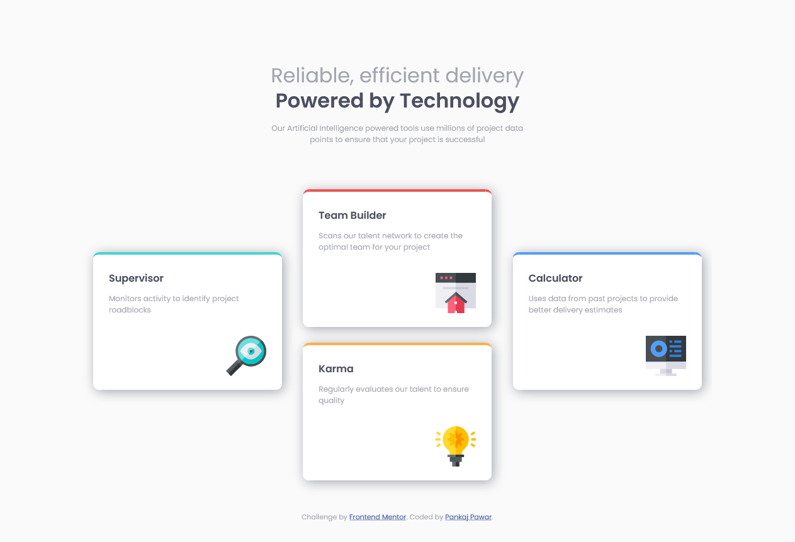

# Frontend Mentor - Four card feature section solution

This is a solution to the [Four card feature section challenge on Frontend Mentor](https://www.frontendmentor.io/challenges/four-card-feature-section-weK1eFYK). Frontend Mentor challenges help one improve your coding skills by building realistic projects. 

## Table of contents

- [Overview](#overview)
  - [The challenge](#the-challenge)
  - [Screenshot](#screenshot)
  - [Links](#links)
- [My process](#my-process)
  - [Built with](#built-with)
  - [Continued development](#continued-development)
- [Author](#author)

## Overview
Four card feature section solution

### The challenge

Users should be able to:

- View the optimal layout for the site depending on their device's screen size

### Screenshot

### Links

- Solution URL: [https://github.com/DamnItAzriel/four-card-feature-section]
- Live Site URL: [https://four-card-feature-section-pink-five.vercel.app/]

## My process
- I will first create a mobile version of the webpage.
- Heading
- 4 Divs
- Desktop version-
- Combined 2 middle divs together in a div
- All 3 divs(Supervisor, Team Builder & Karma, Calculator) are floated to left
- Kept in mind to keep the width same for these divs

### Built with

- Semantic HTML5 markup
- CSS custom properties

### Continued development

- Could make the desktop version better in terms of margin for 1440px.
- Need to improve eyeballing the padding better. 
- I am not comfortable with the heading yet. It should be aligned left instead of center.
- Will look later at it in detail.

## Author

- Website - [Add your name here](https://www.your-site.com)
- Will add this soon!
- Frontend Mentor - [@yourusername](https://www.frontendmentor.io/profile/DamnItAzriel)
- Twitter - [@yourusername](https://twitter.com/DamnItAzriel)
